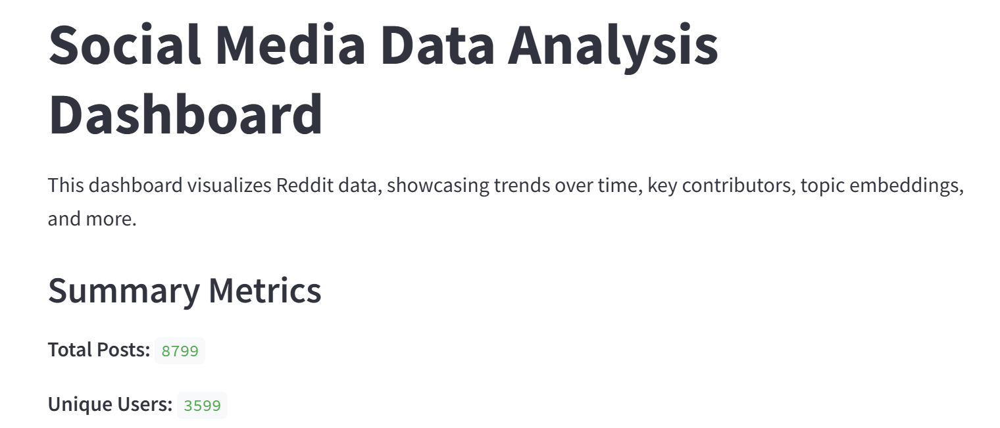
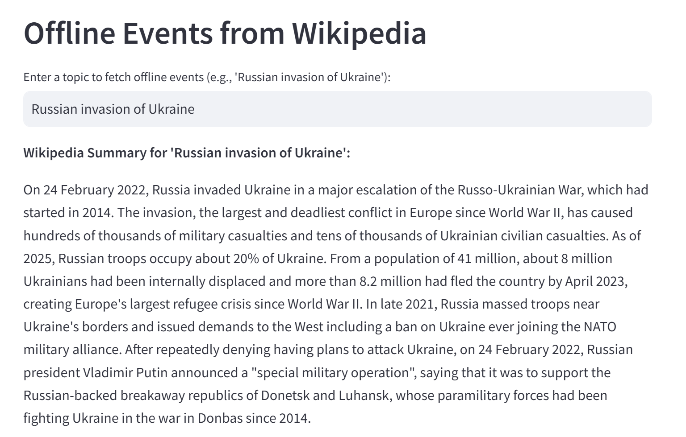
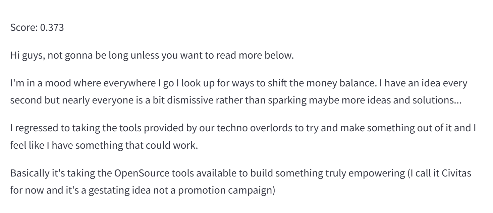

# SimPPL - Social Media Data Analysis Dashboard

- **Name :** Kushal Patel
- **Roll No. :** 22BCE255
- **Nirma University**

- **Demo Video Link :** [Demo Video](https://drive.google.com/file/d/1h8JCwVlwVyHMmnvGHuZw_K_nOLiDdLgu/view?usp=sharing)

This project is an interactive dashboard built with Streamlit to analyze and visualize social media data, specifically Reddit data. It is designed to help you explore trends, sentiment, topics, and the connection between online discussions and offline events.

## Screenshots










## Table of Contents

- [Overview](#overview)
- [Features](#features)
- [Installation](#installation)
- [Usage](#usage)
- [Deployment](#deployment)
- [Dataset Management](#dataset-management)
- [Optional Features](#optional-features)
- [Contributing](#contributing)
- [License](#license)

## Overview

The Social Media Data Analysis Dashboard allows users to:
- **Visualize Trends:** View time series plots with moving averages to observe posting trends over time.
- **Analyze Contributors:** Display key contributors or communities via pie charts.
- **Examine Hashtag Trends:** See the top hashtags used in posts.
- **Sentiment Analysis:** Analyze the sentiment polarity of posts using TextBlob.
- **Advanced Analytics:** Explore topic embeddings using LDA and TSNE.
- **GenAI Summaries:** Generate AI-based summaries of time series data and posts using the BART model.
- **Offline Event Linking:** Retrieve summaries of offline events from Wikipedia to correlate with online trends.
- **Semantic Search:** Perform semantic searches on posts using Sentence Transformers.

## Features

- **Basic Visualizations:**
  - Time Series Plot with 7-day Moving Average
  - Pie Chart for Top Contributors (by subreddit or author)
  - Bar Chart for Top Hashtags
  - Sentiment Analysis Histogram

- **Optional Advanced Features:**
  - **Topic Embedding Visualization:** Uses LDA + TSNE to map out topics from post content.
  - **GenAI Summary for Time Series:** Uses BART to generate a concise summary of posting trends.
  - **Offline Events from Wikipedia:** Retrieves event summaries for a given topic to help connect online narratives with real-world events.
  - **Semantic Search on Posts:** Uses Sentence Transformers to allow natural language queries over post content.
  - **AI-Generated Summary of Posts:** Generates summaries using a hierarchical chunking method for improved accuracy.

## Installation

1. **Clone the Repository:**

   ```bash
   git clone [https://github.com/kushalpatel0265/Simppl.git]
   cd social-media-dashboard
   ```

2. **Ensure Your Dataset is Included:**
   
   - For a small, static dataset, place your `data.jsonl` file in the project root.

3. **Create and Activate a Virtual Environment (Optional but Recommended):**

   ```bash
   python3 -m venv venv
   source venv/bin/activate  # On Windows use: venv\Scripts\activate
   ```

4. **Install Dependencies:**

   ```bash
   pip install -r requirements.txt
   ```

   *Example `requirements.txt`:*
   ```
   streamlit
   pandas
   plotly
   textblob
   networkx
   pyvis
   transformers
   sentence-transformers
   wikipedia
   scikit-learn
   ```

## Usage

1. **Run the Dashboard Locally:**

   ```bash
   streamlit run app.py
   ```

2. **Explore the Dashboard:**

   - Use the sidebar to filter by date or search for keywords/hashtags.
   - Toggle optional features via checkboxes.
   - View visualizations such as time series plots, pie charts, and topic embeddings.
   - Use the semantic search feature to query posts in natural language.
   - Retrieve offline event summaries from Wikipedia.

## Optional Features

- **Topic Embedding Visualization:** Toggle in the sidebar to visualize topic clusters.
- **GenAI Summary for Time Series:** Generate concise summaries of posting trends.
- **Offline Events:** Enter a topic to fetch relevant offline event summaries from Wikipedia.
- **Semantic Search:** Use natural language queries to search for semantically similar posts.
- **AI-Generated Summary:** Generate an overall summary of the posts in the dataset.


## License

This project is licensed under the MIT License. See the [LICENSE](LICENSE) file for details.
